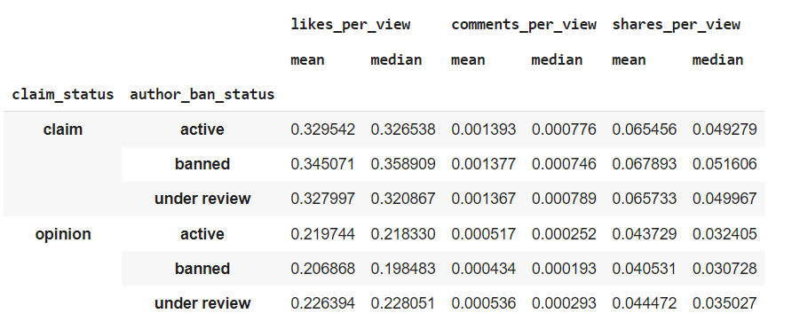
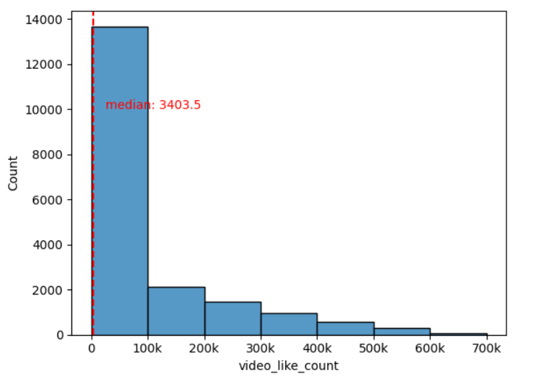
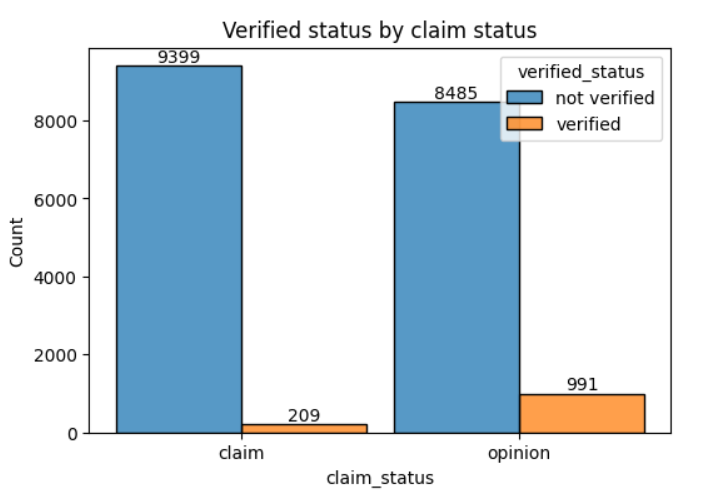
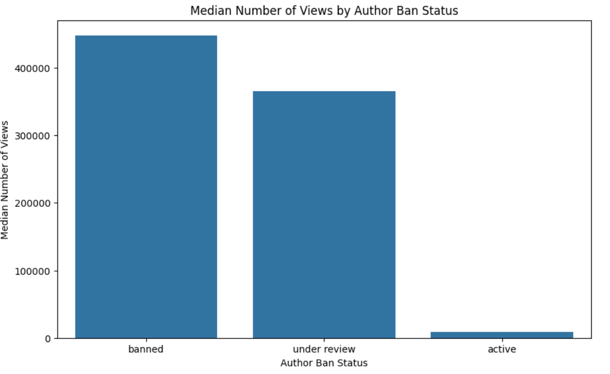
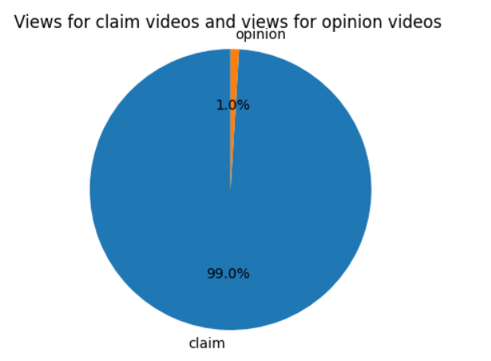
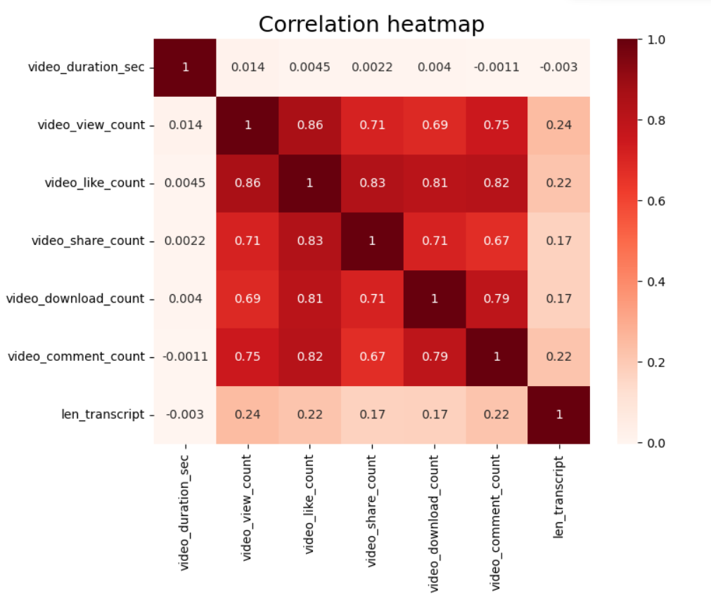
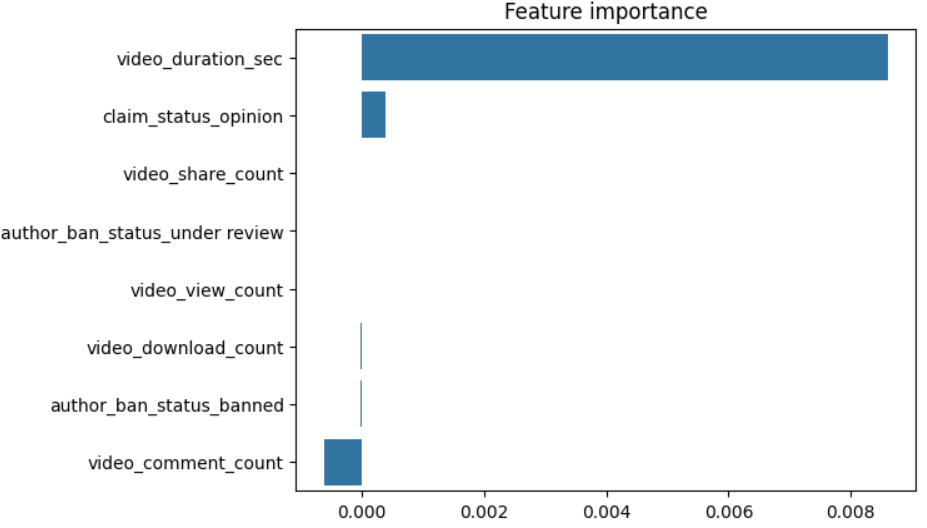
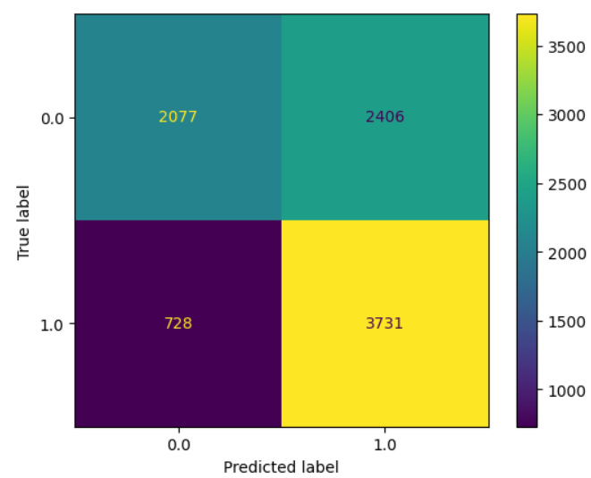
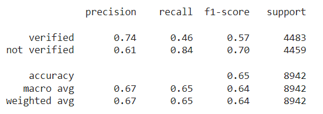
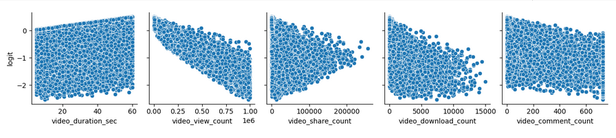

# Project: TikTok Claim Classification

This project aims to utilize machine learning techniques to classify each data point as a claim or opinion. The project comprises five notebooks, each focusing on a different aspect of the data analysis process.

- Notebook 1 - Data Understanding: Initiates the exploration of the provided TikTok dataset by acquainting with the data, compiling summary information, and preparing for further analysis.

- Notebook 2 - Exploratory Data Analysis (EDA): Conducts exploratory data analysis on the TikTok dataset, focusing on factors that differentiate claim videos from opinion videos.

- Notebook 3 - Hypothesis Testing: Demonstrates knowledge of hypothesis testing by applying descriptive and inferential statistics, probability distributions, and hypothesis testing in Python.

- Notebook 4 - Logistic Regression Model: Builds a logistic regression model to predict user churn and evaluates its performance using exploratory data analysis techniques.

- Notebook 5 - Random Forest and XGBoost: Implements Random Forest and XGBoost models to automate the initial stages of the claims process on TikTok, predicting whether a video presents a "claim" or an "opinion."

Each notebook plays a crucial role in understanding the data, conducting analysis, building models, and providing insights regarding claim classification on TikTok.

# Notebook 1: Data Inspection and Analysis

### 1. Percentage of Claims vs. Opinions
- **Findings**: Out of the 19,382 samples in this dataset, approximately 50% are claims, totaling 9,608 samples.

### 2. Factors Correlated with Claim Status

- **Insights**: Engagement level shows a strong correlation with claim status, indicating a need for further investigation into this relationship.

### 3. Factors Correlated with Engagement Level
- **Observation**: For `claim` videos, those with banned authors demonstrate significantly higher engagement compared to videos with active authors or those under review. Conversely, for `opinion` videos, those with authors under review exhibit significantly higher engagement.

# Notebook 2: Exploratory Data Analysis (EDA)

### 1. Distribution Analysis of Variables

**Observations:** 
- The variables related to video metrics such as view count, like count, comment count, and share count exhibit right-skewed distributions, with the majority of videos having relatively low counts.
- Despite the majority of videos having low counts, there are some videos with exceptionally high counts, particularly in terms of views and likes.

### 2. Analysis of Claim Status and Verification Status

**Observations:** 
- Verified users are substantially outnumbered by unverified users, with significantly more unverified users posting both claims and opinions.
- Active authors are more prevalent compared to banned authors for both claims and opinions, indicating a larger presence of active users on the platform.

### 3. Median View Counts Analysis

**Observations:** 
- Videos posted by non-active authors tend to have higher median view counts compared to those posted by active authors, suggesting a potential association between author activity status and video popularity.

### 4. Overall View Count Analysis

**Observations:** 
- Claim videos dominate the total view count, comprising the vast majority of views in the dataset, despite there being a similar number of claim and opinion videos.

### 5. Outlier Threshold Modification
**Observations:** 
- The count variables display heavy right-skewed distributions, indicating the presence of outliers. Modifying the outlier threshold based on the median and interquartile range (IQR) results in a lower threshold compared to using the third quartile, suggesting a more conservative approach to identifying outliers.

# Notebook 3: Hypothesis Testing

### 1. Hypothesis Formulation

**Null Hypothesis ($H_0$):** There is no difference in the number of views between TikTok videos posted by verified accounts and TikTok videos posted by unverified accounts.

**Alternative Hypothesis ($H_A$):** There is a difference in the number of views between TikTok videos posted by verified accounts and TikTok videos posted by unverified accounts.

### 2. Hypothesis Test Result

- **p-value:** 2.61e-120
- **Interpretation:** The p-value is significantly lower than the chosen significance level (usually 0.05). Therefore, we reject the null hypothesis. This suggests that there is evidence to support the presence of a difference in average view counts between videos from verified and unverified accounts.

### 3. Implications

- The analysis indicates a statistically significant difference in average view counts between verified and unverified TikTok accounts.
- Further investigation into the root causes of this difference in user behavior is warranted. For instance, exploring whether unverified accounts tend to post more sensational content or if they are associated with spam activities.
  
### 4. Next Steps

- Building a regression model focused on the `verified_status` variable to analyze user behavior within the verified user group.
- Given the skewed nature of the data and significant differences in account types, a logistic regression model is recommended for this analysis.

# Notebook 4: Logistic Regression Model

### 1. Multicollinearity Issues

- **Observation**: The dataset contains a few strongly correlated variables, which may lead to multicollinearity issues when fitting a logistic regression model. To mitigate this, `video_like_count` was dropped from the model building process.

### 2. Impact of Video Duration on Verified Status

- **Insight**: According to the logistic regression model, each additional second of the video is associated with a 0.0086 increase in the log-odds of the user having a verified status.

### 3. Model Performance
<table>
  <tr>
    <td></td>
    <td></td>
  </tr>
</table>

- **Findings**: The logistic regression model demonstrated acceptable predictive power, with a precision of 61% and a recall of 84%. Although overall accuracy was moderate, the model's recall rate indicates its effectiveness in identifying verified users.

### 4. Consideration of Non-linear Relationships

- **Observation**: The pair plot visualization suggested potential non-linear relationships between predictor variables and the target variable. This implies that logistic regression may not fully capture the complexity of the relationship, prompting consideration of more flexible modeling approaches.

  
